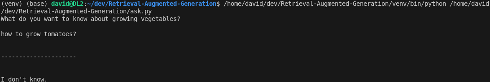
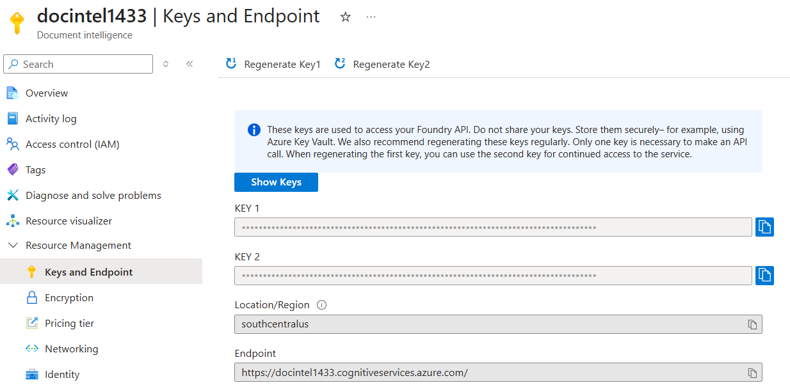
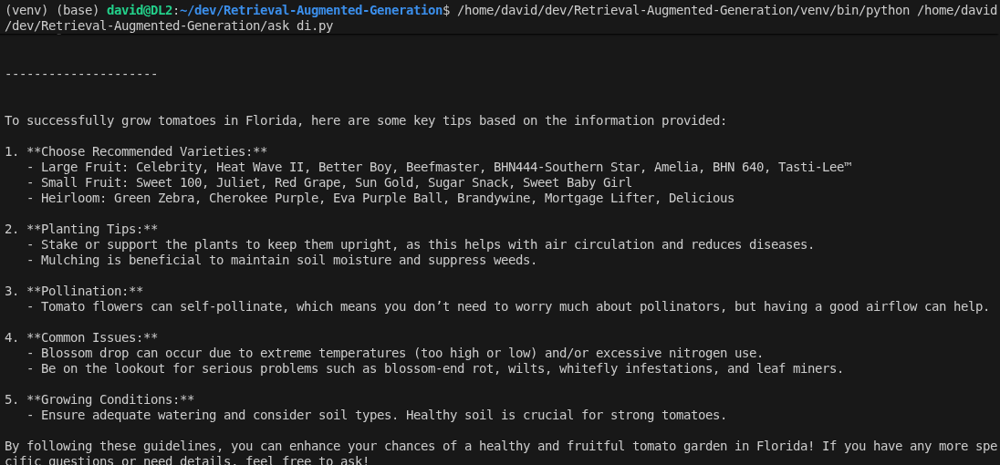
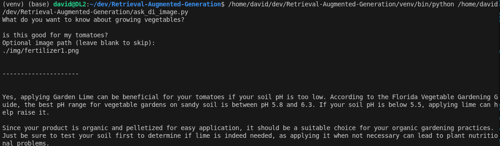

## RAG Deep Dive
RAG is one of those things that are super easy to do, but pretty hard to do it right. I'll walkthrough a few common issues in RAG and detail how I solved them. 

I'm starting with this 10-min RAG tutorial:

<h2>Installation Prerequisites</h2>
<ul>
  <li>Python 3.11+</li>
</ul>

<h2>Installation</h2>
<h3>1. Clone the repository:</h3>

```
git clone https://github.com/davyuan/RAG_DeepDive.git
cd Retrieval-Augmented-Generation
```

<h3>2. Create a virtual environment</h3>

```
python -m venv venv
```

<h3>3. Activate the virtual environment</h3>

```
venv\Scripts\Activate
(or on Mac): source venv/bin/activate
```

<h3>4. Install libraries</h3>

```
pip install -r requirements.txt
```

<h3>5. Add OpenAI API Key</h3>
Get an OpenAI API Key from here: https://platform.openai.com/settings/organization/admin-keys<BR>
Add it to .env.example<BR>
Rename to .env<BR>

<h2>Executing the scripts</h2>

- Open a terminal in VS Code

- Execute the following command:

```
python fill_db.py
python ask.py
```
## GIGO problem
Ask the RAG-enhanced AI a simple question: How to grow tomatoes? and I'm disappointed that AI can't give me answer. 



Why? All PDF file parser are not created equal. Some are better than others. The PyPDF parsers can't parse a vertical table. So even the document does include information about Tomato planting. It is not ingested propertly into the ChromaDB.


How to solve this Garbage In Garbage Out problem? [Azure AI Document Intelligence](https://azure.microsoft.com/en-us/products/ai-foundry/tools/document-intelligence) or [LlamaIndex.Parse](https://www.llamaindex.ai/llamaparse) are the two options at the moment of writing. I have tried a few other free library out there, such as PDFPlumber, sad to report none of them work.

I'm using the Azure Doc Intelligence, and its Langchain wrapper. I'm attaching a screenshot on how to create it in Azure and where to get the endpoint and key: 

Put the endpoint and key in the .env file and you can load it like this:

```python
        loader = AzureAIDocumentIntelligenceLoader(
            api_endpoint=AZURE_ENDPOINT, 
            api_key=AZURE_KEY, 
            file_path=file_path, 
            api_model="prebuilt-layout",
            analysis_features=["ocrHighResolution"]          
        )
        
        raw_docs = loader.load() 
```

## Does size matter for chunks?
Yes it does. While many researcher and practitioner recommend smaller chunk size for text. I don't believe this works for tables. Once a big table is chunked up, the chunks lose their header and hence the semantic meanings. This creates two problems. 

- When these chunks are queried against in vector DB, they are less likely to be retrieved as they have no meaning. 
- When these chunks are sent to the LLM as context, they are nothing but pile of words. 

We need to either keep the tables in one chunk, or replicate the headers for each chunks. I'll opt for the former for simplicity. 

Since Azure Document Inteligence parses the table and put it in HTML <table> tag pair. I'm using the RecursiveCharacterTextSplitter to split 'normal' text, but keep the HTML tables intact. 

```python
def split_with_variable_sizes(raw_text, text_limit=TEXT_LIMIT, chunk_overlap=CHUNK_OVERLAP):
    # Regex to find everything between <table> and </table>
    # Flags=re.S ensures . matches newlines
    blocks = re.split(r'(<table>.*?</table>)', raw_text, flags=re.S)
    
    text_splitter = RecursiveCharacterTextSplitter(
        chunk_size=text_limit,
        chunk_overlap=chunk_overlap,
        separators=["\n\n", "\n", ". ", " ", ""]
    )
    
    final_chunks = []
    
    for block in blocks:
        if not block.strip():
            continue
            
        if "<table>" in block:
            # --- Handle Table ---
            block = table_to_markdown(block)
            final_chunks.append(block)
        else:
            # --- Handle Standard Text ---
            final_chunks.extend(text_splitter.split_text(block))
            
    return final_chunks
  ```

With this change, chromeDB now has the proper data in store. However I still don't see ChromaDB returing the table chunk that contains the Tomato planting information, when queried with 'How to grow Tomatoes?' Why? 

It is because the Doc Intelligence wraps up the table in the HTML tags. There are a ton of '&lt;tr&gt;', '&lt;/tr&gt;', '&lt;td&gt;', '&lt;/td&gt;' tags in the chunk, which serves a purpose of segregating the table cells, but they don't have any semantical meaning in similarity search. i.e. they diluted the weights when ChromaDB is comparing the embeddings of the query text with these chunks. 

To Solve this, I need to change it to use markdown format, which is essentially using '|' as separator, and it is much more embeddings friendly. 

```python
def table_to_markdown(html):
    soup = BeautifulSoup(html, "html.parser")
    table = soup.find("table")

    rows = []
    for tr in table.find_all("tr"):
        cells = [c.get_text(strip=True) for c in tr.find_all(["th", "td"])]
        rows.append(cells)

    md = []
    header = rows[0]
    md.append("<!--table-->")
    md.append("| " + " | ".join(header) + " |")
    md.append("| " + " | ".join(["---"] * len(header)) + " |")

    for row in rows[1:]:
        md.append("| " + " | ".join(row) + " |")

    return "\n".join(md)
```
More details can be found in [fill_db_di.py](./fill_db_di.py)

Now with data ingestion pipeline in order, we need to work on our query workflow. Two common techniques used in RAG workflow to improve LLM response quality are:
- Query combination
- Reranking

In [ask_di.py](./ask_di.py), first I'm querying data from non-table text, and also querying data from tables. Then I combine them together. This is neccessary since in our use case lots of vegetable planting knowledge is scattered in the tables, and this knowledge can't be retrieved by a vector similarity search automatically. 

```python
text_results = collection.query(
    query_texts=[user_query],
    n_results=2,
    where={"is_table": False},
)

table_results = collection.query(
    query_texts=[user_query],
    n_results=2,
    where={"is_table": True},
)

entries = normalize_results(text_results) + normalize_results(table_results)
```

The other common technique used in Retrival is reranking. Researchers have shown that LLMs are more sensitive to the text in the beginning or the end of context and are more likely to respond to those chunks. This is the opportunity for us to finetune the priorities we assign to the chunks retrived. 

```python
def rerank_results(entries):
    """Sort the provided entries to surface tables first and use distance as a tiebreaker."""
    return sorted(
        entries,
        key=lambda x: (
            x["metadata"].get("is_table", False),
            -x["distance"] if x["distance"] is not None else 0,
        ),
        reverse=True,
    )
```

## Result
With all these techniques in retrival and generation, now our AI has become much smarter in answering the planting questions!



## Image query
A common use case in RAG is a user queries with an image. For example, they are not sure if a fertilizer is good for the vegetable they are growing, they take out their phone and take a picture. Then they ask the AI, is this good for my tomato? 

Or they can send an picture of a bug on their tomato stem and ask, what pesticide do I need for this? 

To handle this use case, do we need to embed everything in the vector DB in CLIP/OpenCLIP, so we can query the vector DB with the image embeddings? 

I don't think so. I believe we can handle it with a slight change of our query workflow. 

- Use a vision LLM to describe the query image. Essentially we transcribe the image into text.
- Combine the output of the vision LLM and the user text query into one single query.
- Send the combined query to our vector DB to retrive context knowledge.
- Combine the user text input, the transcribed image description, and the context knowledge and send it to LLM for the final answer. 

Here are the code snippet for it:

```python
image_description = ""
if image_input:
    image_path = Path(image_input)
    if image_path.exists():
        image_description = describe_image(client, image_path)
    else:
        print(f"Warning: {image_input} does not exist; skipping vision step.")

combined_query = "\n".join(filter(None, [user_query.strip(), image_description.strip()]))
if not combined_query:
    raise SystemExit("No query or image description provided.")

results = collection.query(
    query_texts=[combined_query],
    n_results=4
)
```

```python
system_prompt = generate_rag_sys_prompt(reranked_results)

response = client.chat.completions.create(
    model="gpt-4o-mini",
    messages=[
        {"role": "system", "content": system_prompt},
        {
            "role": "user",
            "content": (
                user_query
                if not image_description
                else f"{user_query}\n\nImage details:\n{image_description}"
            ),
        },
    ],
)
```
Full code is in [ask_di_image.py](./ask_di_image.py)

## Result
I can finally figure out with an image!



## Acknowledgement and Future work
This repo is inspired and based on the work from [RAG in 10 mins](https://github.com/ThomasJanssen-tech/Retrieval-Augmented-Generation)

It turns out a working-well RAG pipeline takes a little more than 10 mins to build. When I have a little more time, I might want to explore a image rich doc set and multi-modal embeddings!